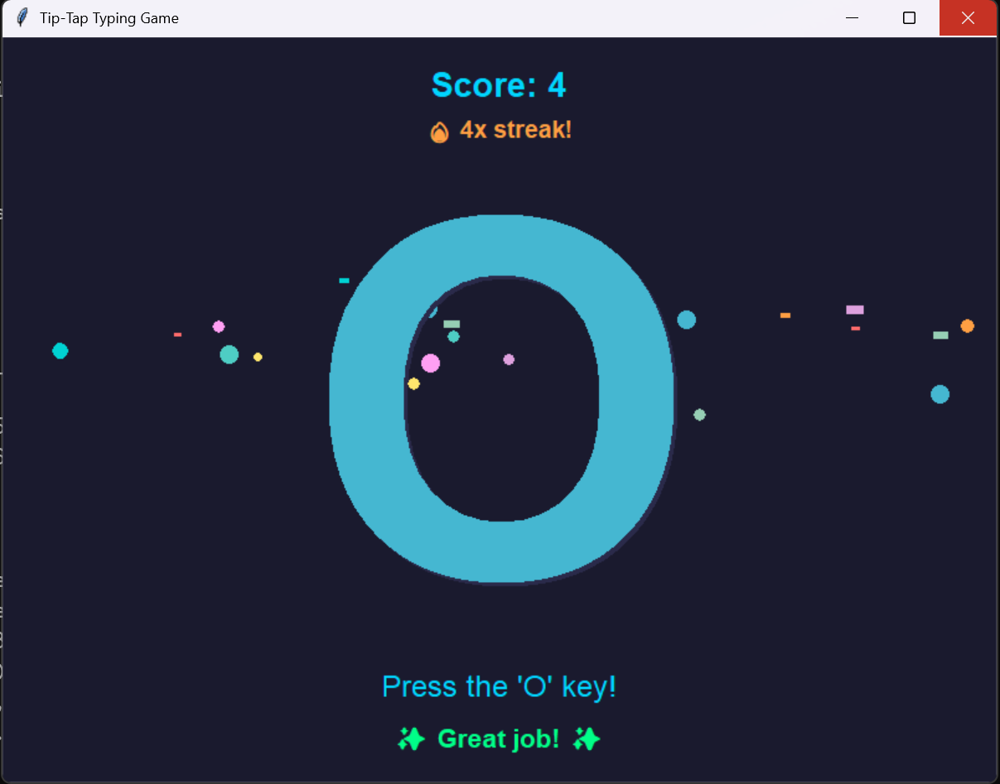

# Tip-Tap

A typing game for youngsters



## Description

Tip-Tap is a fun and educational typing game designed for young children learning to recognize letters and numbers while practicing typing. The game displays large, colorful characters on screen — press the matching key to score points and build a win streak!

## Features

- Large, colorful letters and numbers fill the screen for easy recognition
- Bounce animation when each new character appears
- Confetti shower on correct answers
- Rainbow flash and ascending musical chime on correct answers (Windows)
- Shake animation and descending buzz on wrong answers (Windows)
- Win streak counter with bonus milestone celebrations at 3, 5, and 10 in a row
- Score tracking
- Configurable character sets (letters, numbers, or both)
- Scales to any window size
- No external dependencies — pure Python stdlib

## Requirements

- Python 3.x (no additional libraries needed — uses built-in tkinter)

## Platform Support

- ✅ Windows (full audio support via `winsound`)
- ✅ Linux (including WSL2)
- ✅ macOS

## How to Run

```bash
# Default mode (letters only)
python tip_tap.py

# Letters only
python tip_tap.py -letters

# Numbers only
python tip_tap.py -numbers

# Both letters and numbers
python tip_tap.py -letters -numbers
```

## How to Play

1. A large letter or number appears on screen
2. Press the matching key on your keyboard
3. Score points and keep your streak alive!
4. Close the window when you're done playing

## License

MIT License - see LICENSE file for details

---

Made with ❤️ for my daughter

## Security scanning

[Snyk](https://snyk.io) runs on every push and pull request, and weekly on a schedule,
via [`.github/workflows/snyk.yml`](.github/workflows/snyk.yml):

- **Snyk Code** — static analysis of first-party source

Findings are published to this repository's **Security → Code scanning** tab. The build
fails on anything at `high` severity or above.

Run the same scans locally before pushing:

```powershell
./scripts/Invoke-SnykScan.ps1                          # exactly what CI runs
./scripts/Invoke-SnykScan.ps1 -SeverityThreshold low   # everything, including noise
```

Requires the Snyk CLI (`winget install Snyk.Snyk`) and a one-time `snyk auth`.
